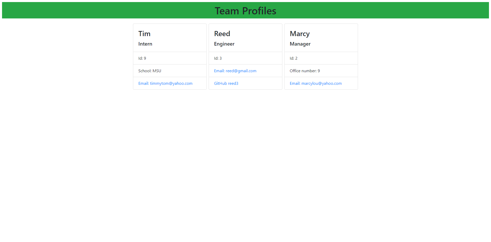

# Team Profile Generator

## Screenshot/Video

[Usage Video](https://drive.google.com/file/d/1ySs7mw4178CoIHD3MW9--26ZvjaQSMKD/view)

## Overview

>For this project, you open the terminal and answer employee questions that generate an HTML file with your answers.

## Installation

>To install, go to the GitHub repository and clone either the https or SSH key in your terminal.

## Usage

>To use this app, "cd" into the correct folder in your terminal. Once you're in the folder, enter "node employee.js" and you will be prompted with questions.

## Tests

>To run the tests, "cd" to the team-profile-generator directory and type "npm run test".

## License

